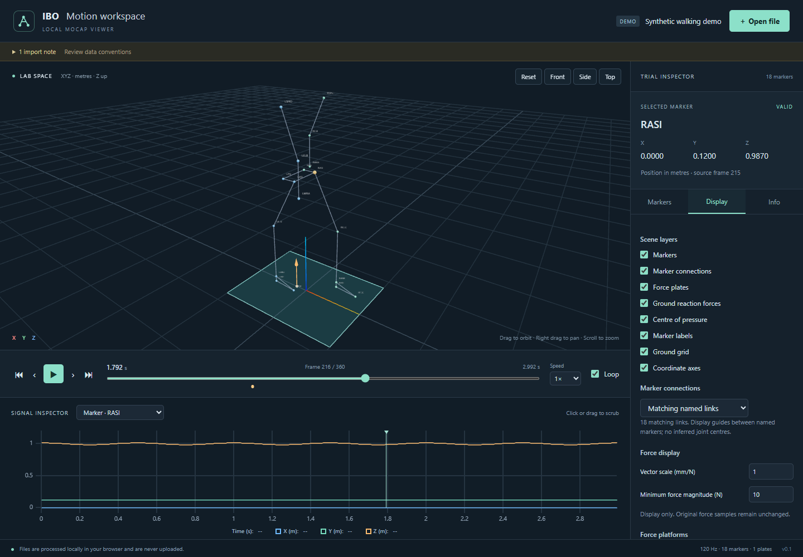

# IBO Motion workspace

A browser-based C3D and institute H5 motion-capture viewer for biomechanics. Built with TypeScript, React, Vite, Three.js / React Three Fiber, drei, Zustand, uPlot and h5wasm.

**Motion-capture files are processed entirely locally in the browser. Files are not uploaded to a server.** No backend, database, telemetry, analytics, remote fonts, or runtime CDN dependencies. Opening a file may fetch bundled application code, but never sends the filename, labels, metadata or measurements.



The screenshot uses generated demonstration data, not a participant recording.

## Run

Use Node.js 22.12+ (Node 24 recommended).

```sh
npm install
npm run dev
```

Open the local URL printed by Vite, normally http://127.0.0.1:5173. On Windows PowerShell where `npm.ps1` is disabled, use `npm.cmd install` and `npm.cmd run dev`; no execution-policy change is needed.

Choose **Open file**, drop a recording anywhere, or explore the synthetic demo. Files are loaded one at a time. Loading can be cancelled; a failed import leaves the previous trial available.

## Features

- Local `.c3d`, `.h5` and `.hdf5` loading in a cancellable Web Worker.
- Shared format-independent 3D viewer and playback for both formats.
- Instanced markers, missing-sample handling, residuals, selection, search and individual visibility.
- Named marker connection presets for the inspected IBO sets and Plug-in Gait; selectable or disabled. These are display links, not an anatomical model.
- Force-platform geometry, global GRF arrows originating at COP, and COP points.
- Force types 2, 3 and 4, including 6×6 calibration and type-3 COP polynomial correction.
- Orbit, pan, zoom, reset, front, side and top camera presets; Z-up lab axes and ground grid.
- True-rate playback, scrubbing, stepping, beginning/end, speed and loop controls.
- Synchronized marker XYZ, force, moment, COP and analog plots, with plot scrubbing.
- Standard C3D events, file statistics, source metadata and visible import warnings.
- Explicit SI units: positions/COP in m, force in N, moments in Nm. Display arrow scale defaults to 1 mm/N; threshold defaults to 10 N and changes display only.

Keyboard: **Space** play/pause, **← / →** step, **Home / End** first/last frame, when focus is outside a form control. The timeline shows ordinal frames starting at 1; the marker inspector also shows the source's zero-based frame number.

## Supported formats and limits

| Format       | Supported                                                                                                                                                                                                           |
| ------------ | ------------------------------------------------------------------------------------------------------------------------------------------------------------------------------------------------------------------- |
| C3D          | Intel little-endian and MIPS big-endian; integer and IEEE float point records; parameter labels and continuation labels; scaled signed/unsigned analogs and subframes; residual validity; events; force types 2/3/4 |
| Institute H5 | `Trajectories/Labeled/Data [marker,4,frame]`, Labels and SamplingFrequency; optional analogs/force groups; compressed HDF5; both inspected converter generations                                                    |

DEC/VAX C3D encoding and nonstandard rotation records are explicitly rejected. Unsupported force-platform types are reported and omitted, while marker and analog data remain accessible. Other HDF5 schemas are not supported.

H5 coordinate conventions contain contradictions in the reference exporter. Recognized legacy output keeps its already-global values with a warning. Other unresolved force frames remain available for signal inspection, but require explicit confirmation of stored-global coordinates for spatial force display. Missing legacy marker units assume mm with a warning. H5 Type codes and event/rigid-body schemas are not guessed. See [H5 format](docs/H5_FORMAT.md) and [open questions](docs/OPEN_QUESTIONS.md).

No trajectory editing, scientific filtering, export, inferred joint centres, gait-event detection, video, or persistent file storage is included. Marker timelines must be present. Mobile is secondary; current Chromium browsers are the runtime validation target. Large file limits depend on browser memory. There is no service worker yet: a cached tab can keep working, but reliable offline reload/PWA installation is not claimed.

## Architecture

```text
local File → Worker → C3DImporter / H5Importer → MotionData
                                                 ├─ shared 3D scene
                                                 ├─ timeline / playback
                                                 ├─ synchronized plots
                                                 └─ inspector
```

`MotionData` contains contiguous typed arrays with validity, original-rate signals, explicit units, independent geometry timing and provenance. Rendering components never branch on C3D/H5. Workers transfer buffers back and terminate to release parser/WASM memory. The small timeline and coordinate inspector subscribe to frame changes; 3D buffers and plot cursor update imperatively.

See [architecture](docs/ARCHITECTURE.md), [Python audit](docs/PYTHON_REFERENCE.md), [migration map](docs/MIGRATION.md), [parser decisions](docs/PARSERS.md), and [validation](docs/VALIDATION.md).

## Tests and production build

```sh
npm test
npm run typecheck
npm run build
npm run preview
```

`dist/` is a completely static application. Use HTTP hosting rather than opening index.html as a `file://` URL, because module workers require an appropriate origin.

Scientific tests cover units, frame/time mapping, gaps, binary C3D variants, real compressed HDF5, force transformations/calibration/COP and malformed input. Synthetic fixtures contain no measurement data. Private local reference comparisons are automatically skipped when their ignored oracle is absent.

With Chrome installed, run the browser and privacy smoke check after building:

```sh
npm run test:browser
```

For Microsoft Edge, set `BROWSER_CHANNEL=msedge`. This check exercises demo controls, synthetic C3D/H5, any available sibling reference files, error recovery, request URLs/methods/bodies and browser storage. Reports and screenshots stay under ignored `.local/`.

Optional local numerical comparison requires Python with ezc3d/numpy and the original sibling `ibo-biomech` files:

```sh
python scripts/reference-export.py
npm run validate:reference
```

This Python script is a development oracle, never a backend or application dependency. It reads the originals without modifying them and writes only ignored local output.

## GitHub Pages

Push this project to a GitHub repository with a `main` branch. In **Settings → Pages**, choose **GitHub Actions** as the deployment source. The included [workflow](.github/workflows/deploy.yml) runs `npm ci`, tests, the typechecked production build, and deploys only `dist/`. Pull requests run checks without deploying. No custom secrets are needed.

The workflow defaults to `/<repository-name>/`. Set the repository Actions variable `VITE_BASE_PATH` to `/` for a custom domain or user/organization root site, or to another explicit path. For a local build:

```powershell
$env:VITE_BASE_PATH = '/ibo-mocap-visualizer-webapp/'
npm.cmd run build
```

Outside CI, the default base is relative (`./`). Source measurements, local comparison output, and node_modules are ignored; do not add private files to `public/`, because that directory is copied to the deployed site.

## Roadmap

Establish a versioned H5 coordinate/event schema; extend C3D variants using validation fixtures; configurable marker-set import; gap inspection; local export; app-only PWA caching; then consider filtering, editing and additional formats behind the existing importer boundary.
