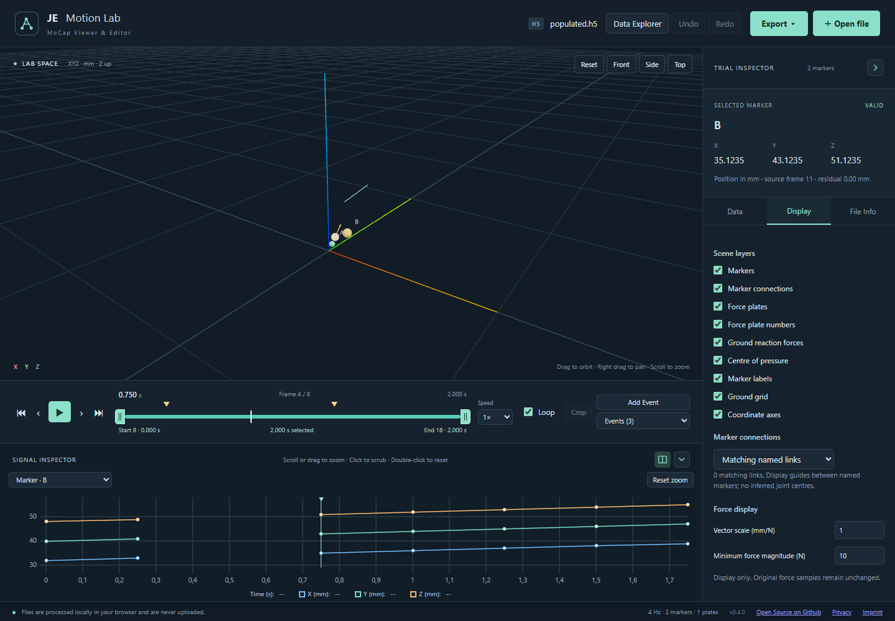

# JE Motion

**MoCap Viewer & Editor**

A browser-based, privacy-first motion capture viewer and editor for biomechanics researchers and technically interested users. Inspect recordings in 3D, compare synchronized signals, edit events, crop trials, and download the results in their original format.

[Open JE Motion on GitHub Pages](https://jebbecke.github.io/mocap-web-viewer/). This is the default Pages address derived from the repository remote and deployment workflow; a repository-level base-path override or custom domain may change it.

**Motion-capture files are processed entirely locally in the browser. Files are not uploaded to a server.** JE Motion sends anonymous usage events for session visits and successful C3D/H5 loads to a Cloudflare Worker for aggregate country statistics in D1. Analytics payloads contain only an event type, never MoCap files, filenames, labels, metadata or measurements. Normal network information is still visible to hosting and Cloudflare; see [Privacy](#privacy) for the scope and backend verification limits. There are no remote fonts or runtime CDN dependencies.



The retained screenshot uses generated example data, not a participant recording. It illustrates an earlier viewer layout; newer controls and the footer version may differ.

## Basic usage

1. Open the application and choose **Open file** or drop a recording anywhere. One recording is loaded at a time; imports can be cancelled, and a failed import leaves the previous trial available.
2. Orbit, pan and zoom the 3D view. Select a marker to inspect coordinates, or use the inspector to adjust visibility and force display. Review import warnings before interpreting data.
3. Play, step or scrub the timeline. Select a signal in the signal inspector; use **Split plots** for two independent selections sharing the playback cursor.
4. Click a timeline event to edit it, or choose **Add Event** at the current playback position. Supported fields depend on the source format.
5. Drag the timeline's start/end handles, preview the interval and choose **Crop**. Choose **Export** to download a local copy. **Restore original** discards both crops and event edits; the source file remains unchanged.

## Development setup

Use Node.js 22.12+ (Node 24 recommended).

```sh
npm ci
npm run dev
```

Open the local URL printed by Vite, normally http://127.0.0.1:5173. On Windows PowerShell where `npm.ps1` is disabled, use `npm.cmd ci` and `npm.cmd run dev`; no execution-policy change is needed.

## Features

- Use the **Split plots** icon beside the hide toggle in the signal inspector to switch between one and two plots. Split view shows two side-by-side plots with independent marker/force/analog selection and zoom. Both follow the same playback cursor; clicking either plot scrubs the recording. On narrow windows, the split area scrolls horizontally.

- Local `.c3d`, `.h5`, and `.hdf5` loading in a cancellable Web Worker.
- Shared format-independent 3D viewer and playback for both formats.
- Instanced markers, missing-sample handling, residuals, selection, search and individual visibility.
- Named marker connection presets for the inspected IBO sets and Plug-in Gait; selectable or disabled. These are display links, not an anatomical model.
- Static and time-varying force-platform geometry, global ground reaction force (GRF) arrows originating at the centre of pressure (COP), and COP points where coordinate conventions are established.
- Force types 2, 3 and 4, including 6×6 calibration and type-3 COP polynomial correction.
- Orbit, pan, zoom, reset, front, side and top camera presets; Z-up lab axes and ground grid.
- True-rate playback, scrubbing, stepping, beginning/end, speed and loop controls.
- Non-destructive timeline cropping, range preview, restoration and local **Export** in the source C3D/H5 format. See [crop conventions and export limits](docs/CROPPING_EXPORT.md).
- Synchronized marker XYZ, force, moment, COP, optional free moment and analog plots, plus institute H5 EMG and rigid-body position signals when present. Scroll up/down over the plot to zoom in/out around the pointer, or drag horizontally to select a zoom range. Click to scrub; double-click or use **Reset zoom** to restore the full time range.
- Arrow toggles in the plot and sidebar headers collapse or expand each panel; a compact edge control remains available to reopen it.
- C3D and versioned institute H5 timeline events with add/edit/delete, format-supported text fields, crop-aware export and restoration. File statistics, source metadata and import warnings remain visible.
- Explicit SI units: positions/COP in m, force in N, moments in Nm. Display arrow scale defaults to 1 mm/N; threshold defaults to 10 N and changes display only.

Keyboard: **Space** play/pause, **← / →** step, **Home / End** first/last frame, when focus is outside a form control. The timeline shows ordinal frames starting at 1; the marker inspector also shows the source's zero-based frame number.

## Supported formats and limits

| Format       | Supported                                                                                                                                                                                                           |
| ------------ | ------------------------------------------------------------------------------------------------------------------------------------------------------------------------------------------------------------------- |
| C3D          | Intel little-endian and MIPS big-endian; integer and IEEE float point records; parameter labels and continuation labels; scaled signed/unsigned analogs and subframes; residual validity; events; force types 2/3/4 |
| Institute H5 | `Trajectories/Labeled/Data [marker,4,frame]`, Labels and SamplingFrequency; optional analogs/force groups; compressed HDF5; both inspected converter generations                                                    |

DEC/VAX C3D encoding and nonstandard rotation records are explicitly rejected. Unsupported force-platform types are reported and omitted, while marker and analog data remain accessible. Other HDF5 schemas are not supported.

H5 coordinate conventions contain contradictions in the reference exporter. Recognized legacy output keeps its already-global values with a warning. Other unresolved force frames remain available for signal inspection, but require explicit confirmation of stored-global coordinates for spatial force display. Missing legacy marker units assume mm with a warning. The authoritative H5 adds explicit clocks, events, EMG, rigid-body data and quality flags. IKResults and IDResults are currently ignored by the viewer; their source data remains available for export. Type codes and unprovided coordinate conventions are not guessed. See [H5 format](docs/H5_FORMAT.md) and [open questions](docs/OPEN_QUESTIONS.md).

No general trajectory editing, scientific filtering, format conversion, inferred joint centres, gait-event detection, video, or persistent file storage is included. Marker timelines must be present. Mobile is secondary; current Chromium browsers are the runtime validation target. Large file limits depend on browser memory. There is no service worker yet: a cached tab can keep working, but reliable offline reload/PWA installation is not claimed.

Use a modern desktop browser with WebGL, WebAssembly and module worker support. Chrome is the default browser smoke-test target, with an Edge option; Firefox and Safari compatibility has not been established by the included checks. Hardware acceleration is recommended for 3D rendering.

Exports preserve source values rather than writing normalized display coordinates. Unchanged exports return the original bytes. Modified exports have format-specific limits: C3D event editing supports up to 255 events, force-baseline intervals must survive cropping, and unknown H5 time-dependent datasets or unsupported storage types may block modified export. H5 marker clocks must be regular; other supported signal clocks may be irregular. Rigid-body rotations are retained as structured data, not rendered as an anatomical skeleton. See [cropping/export limits](docs/CROPPING_EXPORT.md), [event editing](docs/EVENT_EDITING.md) and [H5 validation](docs/H5_VALIDATION.md), including the legacy institute reader incompatibility.

## Architecture

The application is a static TypeScript/React site built with Vite. Three.js, React Three Fiber, and drei provide 3D rendering; Zustand holds session state; uPlot renders signals; and h5wasm reads and writes HDF5 locally. A separate Cloudflare Worker receives anonymous usage events for aggregation in D1; motion-capture data remain entirely local. The Worker and database are managed outside this repository; see [analytics architecture and verification scope](docs/ANALYTICS.md).

```text
local File → Worker → C3DImporter / H5Importer → MotionData
                                                 ├─ shared 3D scene
                                                 ├─ timeline / playback
                                                 ├─ synchronized plots
                                                 └─ inspector
```

`MotionData` contains contiguous typed arrays with validity, original-rate signals, explicit units, independent geometry timing and provenance. Rendering components never branch on C3D/H5. Workers transfer buffers back and terminate to release parser/WASM memory. The small timeline and coordinate inspector subscribe to frame changes; 3D buffers and plot cursor update imperatively.

| Location                                           | Responsibility                                                     |
| -------------------------------------------------- | ------------------------------------------------------------------ |
| `src/importers/`, `src/exporters/`, `src/workers/` | Format parsing, source-preserving export and background processing |
| `src/motion/`                                      | Shared data model, timing, crop and event operations               |
| `src/state/`, `src/playback/`                      | In-memory session and playback clock                               |
| `src/viewer/`, `src/plots/`, `src/components/`     | 3D scene, signal inspector, timeline and editing controls          |
| `tests/`, `scripts/`, `docs/`                      | Synthetic fixtures, validation tools and technical documentation   |

See [architecture](docs/ARCHITECTURE.md), [Python audit](docs/PYTHON_REFERENCE.md), [migration map](docs/MIGRATION.md), [parser decisions](docs/PARSERS.md), and [validation](docs/VALIDATION.md).

## Tests and production build

```sh
npm test
npm run typecheck
npm run build
npm run preview
```

`dist/` is a completely static application. Use HTTP hosting rather than opening index.html as a `file://` URL, because module workers require an appropriate origin.

Scientific tests cover units, frame/time mapping, gaps, binary C3D variants, compressed HDF5, force transformations/calibration/COP and malformed input. Synthetic fixtures contain no measurement data. Private local reference comparisons are automatically skipped when their ignored oracle is absent.

With Chrome installed, run the browser and privacy smoke check after building:

```sh
npm run test:browser
```

For Microsoft Edge, set `BROWSER_CHANNEL=msedge`. This check exercises viewer controls using synthetic C3D/H5 test fixtures, any available local reference files, error recovery, the footer version, request URLs/methods/bodies and browser storage. Analytics requests are intercepted locally to validate event-only payloads without affecting live counts; the check does not validate the deployed Worker or D1. Reports and screenshots stay under ignored `.local/`.

Optional local numerical comparison requires Python with ezc3d/numpy and the original sibling `ibo-biomech` files:

```sh
python scripts/reference-export.py
npm run validate:reference
```

This Python script is a development oracle, never a backend or application dependency. It reads the originals without modifying them and writes only ignored local output.

## GitHub Pages

The included [workflow](.github/workflows/deploy.yml) runs `npm ci`, tests and the typechecked production build. Pushes to `main` deploy only `dist/`; pull requests run checks without deploying. Manual workflow runs deploy only when run on `main`. In **Settings → Pages**, choose **GitHub Actions** as the deployment source. No custom secrets are needed for Pages. This workflow does not deploy the analytics Worker, configure D1 or run the browser smoke check.

The workflow defaults to `/<repository-name>/`. Set the repository Actions variable `VITE_BASE_PATH` to `/` for a custom domain or user/organization root site, or to another explicit path. For a local build:

```powershell
$env:VITE_BASE_PATH = '/mocap-web-viewer/'
npm.cmd run build
```

Outside CI, the default base is relative (`./`). Source measurements, local comparison output, and node_modules are ignored; do not add private files to `public/`, because that directory is copied to the deployed site.

## Privacy

Motion-capture files remain on your computer and are processed locally in browser workers. MoCap files, filenames, labels, source metadata and measurements are never sent to analytics. Imports and edits live in memory, exports are local downloads, and the application does not persist recordings in browser storage.

JE Motion sends a JSON body containing only `{"event":"visit"}`, `{"event":"c3d_loaded"}` or `{"event":"h5_loaded"}` to `https://je-motion-analytics.jonasebbecke97.workers.dev/event`. A `sessionStorage` flag (`je-motion-visit-counted=true`) suppresses repeat visit attempts on reload within the same tab session; it is not a unique identifier and is not sent. Each successful C3D or H5/HDF5 import sends a load event, including repeated loads of the same file. Failed or cancelled imports do not send load events. Counts therefore represent activity, not unique people or unique files. Analytics is also enabled during local development and preview. Failed requests are not retried, so counts may be incomplete.

The documented backend design uses a Cloudflare Worker to derive approximate country from Cloudflare request information and increment D1 counts by date, country and event type. Country is not read from recording metadata or sent in the application payload. The Worker source, D1 schema and logging configuration are not included here, so this repository alone cannot verify deployed aggregation, stored fields or retention. See [analytics details](docs/ANALYTICS.md).

Anonymous here means that the client creates no user/session identifier, tracking cookie or browser fingerprint. The event body includes no file size, device profile or browser information. HTTP requests still expose connection information such as IP addresses and browser-supplied headers (including browser information and the CORS `Origin`) to the receiving infrastructure. The page sets `no-referrer` to suppress the `Referer` header; it does not conceal the IP address or CORS origin. Hosting and Cloudflare may process or log connection information; this is not a guarantee of anonymity at the network level or of log deletion.

The landing page displays aggregate visits, countries and successful MoCap loads from a bodyless GET request to the same Worker's `/stats` endpoint. It appears only while no recording is loaded and is hidden when valid totals are unavailable. Country count is the number of entries in the returned country list; file count uses the combined `files_loaded` total.

The production CSP uses `connect-src 'self' https://je-motion-analytics.jonasebbecke97.workers.dev`. This permits connections to the application origin and the analytics **origin**, including `/event` and `/stats`. Development also allows local Vite WebSocket connections. Bundled scripts, styles and workers load from the application origin; JSON analytics POSTs may require CORS OPTIONS preflight requests. The CSP restricts connection destinations, not request contents; local file handling and the event-only payload keep MoCap data out of analytics.

Keep private recordings out of Git and `public/`. The existing ignore rules exclude H5/C3D recordings and local validation output; `public/` is copied into every deployed build.

## Development status and releases

JE Motion is under active pre-1.0 development. Support is limited to the documented formats and validated conventions; arbitrary vendor variants and general HDF5 files are not claimed. Outstanding format questions are tracked in [OPEN_QUESTIONS.md](docs/OPEN_QUESTIONS.md).

The authoritative application version is in [package.json](package.json), injected at build time and shown subtly in the footer. See [CHANGELOG.md](CHANGELOG.md) for development history and upcoming changes, and [the manual release workflow](docs/RELEASING.md) for Semantic Versioning, release PRs, tags and GitHub Releases. The Pages application follows `main` and can be ahead of the latest formal release.

See [event visualization and editing](docs/EVENT_EDITING.md) for immutable event operations, relative-second timing, C3D serialization and the supported versioned institute H5 event schema. See [authoritative H5 validation](docs/H5_VALIDATION.md) for round-trip results and remaining limits.
